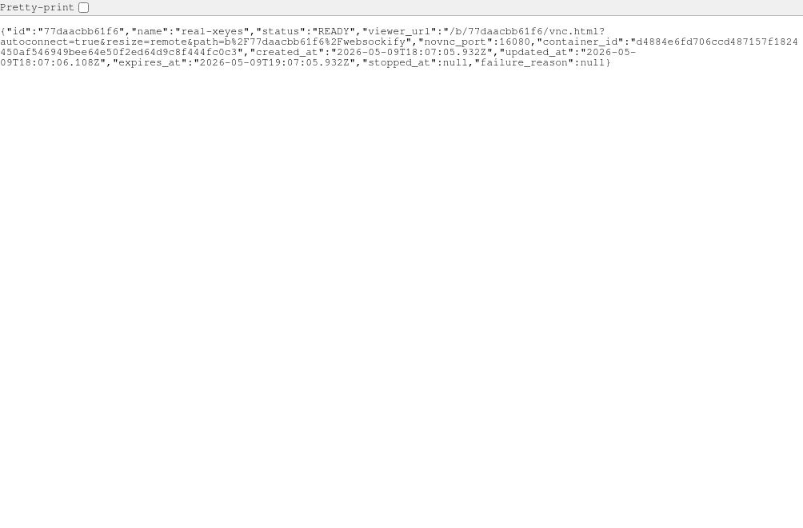
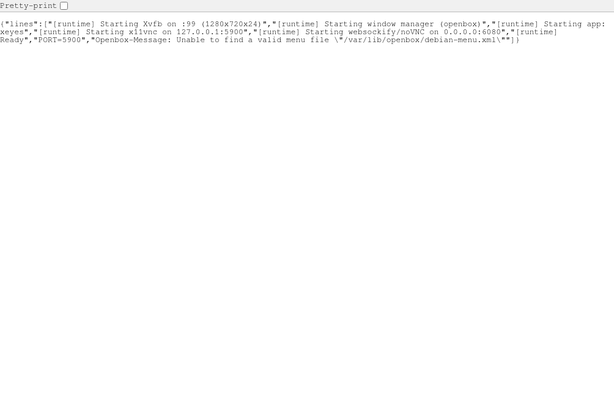
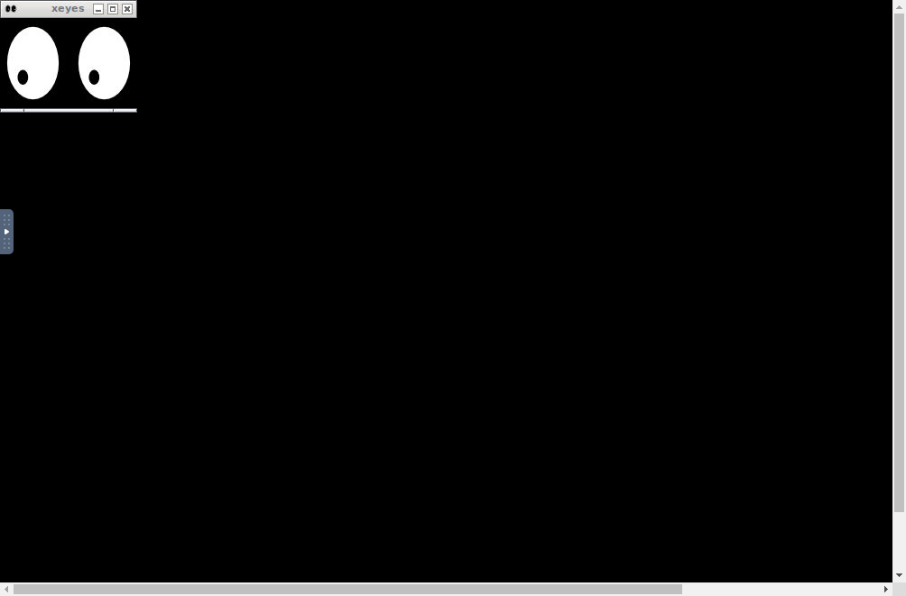
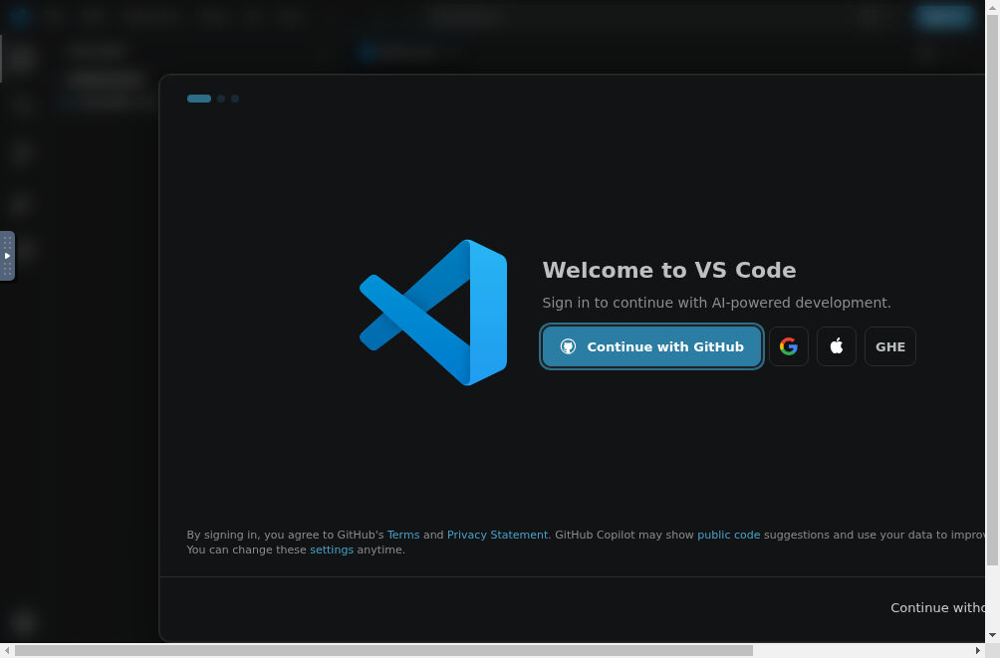

# Web-X11 Container Runtime

Run desktop GUI applications inside isolated Docker containers and access them
from a browser via noVNC. Each session is a separate container with its own
X11 display, window manager and noVNC endpoint, fronted by a single REST API
and path-based gateway.

> Implements the spec in [issue #1](https://github.com/skulidropek/docker-git-web-gui-runtime/issues/1).

## Architecture

```text
Browser
  ↓  HTTP / WebSocket
Orchestrator (Effect-TS)
  ├─ /api/sessions*        REST control plane
  └─ /b/<session_id>/*     gateway to per-session noVNC
                              ↓
                            Docker container
                              Xvfb → openbox → x11vnc → websockify → noVNC
                              ↓
                            GUI application (xterm by default)
```

- **CORE** (`packages/app/src/core/`) — pure domain: session FSM, schema, port
  allocator, gateway path parser, docker-run argv builder. No I/O.
- **SHELL** (`packages/app/src/shell/`) — Effect Layers: SessionStore (Ref),
  Docker (CLI exec), HTTP API + gateway (`@effect/platform`), Clock, IdGen.
- **App** (`packages/app/src/app/main.ts`) — wires layers, runs the HTTP server.

## Quick start

### Run a single session container directly

```sh
docker compose up --build
open http://localhost:6080/vnc.html?autoconnect=true
```

This builds `docker/Dockerfile` and exposes the noVNC viewer on port 6080. The
default app is `xterm`; change it via `START_APP` in `docker-compose.yml`.

### Run the orchestrator

```sh
cd packages/app
corepack pnpm install
corepack pnpm run build
PORT=8080 corepack pnpm run start
```

Then create a session and open the viewer URL the API returns:

```sh
curl -sX POST http://localhost:8080/api/sessions \
  -H 'content-type: application/json' \
  -d '{
    "name": "demo",
    "image": "webx11-runtime:latest",
    "app": "/usr/bin/xterm",
    "resolution": { "width": 1280, "height": 720, "depth": 24 },
    "resources":  { "cpus": 1, "memoryMb": 1024, "shmMb": 256 },
    "ttlSeconds": 3600
  }'
# → { "id": "...", "viewer_url": "/b/<id>/vnc.html?autoconnect=true&...", ... }
```

### Real Docker/browser proof

The PR proof below was captured against a real Docker session, not the fake
Docker layer used by unit tests:







The same flow also supports a heavier GUI app such as VS Code, using an
optional proof image layered on top of the base runtime:



To reproduce the same flow locally:

```sh
packages/app/experiments/real-e2e.sh

# keep the server/session alive for manual browser screenshots
KEEP_ALIVE=1 packages/app/experiments/real-e2e.sh

# build the optional VS Code image and run it through the same orchestrator
packages/app/experiments/real-vscode-e2e.sh
```

## REST API

| Method | Path                          | Body / Result                       |
|--------|-------------------------------|-------------------------------------|
| POST   | `/api/sessions`               | create session → `201 Session DTO`  |
| GET    | `/api/sessions`               | list sessions                       |
| GET    | `/api/sessions/:id`           | get one (404 if unknown)            |
| GET    | `/api/sessions/:id/logs`      | container logs `{ lines: [...] }`   |
| POST   | `/api/sessions/:id/stop`      | drive STOPPING → STOPPED            |
| DELETE | `/api/sessions/:id`           | requires STOPPED first; else 409    |
| GET    | `/api/workspaces`             | selectable launch catalog           |
| GET    | `/api/workspaces/:id`         | one launch option + requirements    |
| POST   | `/api/workspaces/:id/sessions`| launch selected option or setup hint|
| GET    | `/b/<session_id>/<sub>`       | gateway to in-container noVNC       |
| WS     | `/b/<session_id>/websockify`  | proxied VNC stream                  |

`/api/workspaces` exposes the options a client can render as a launcher:
Web-X11 container presets, Kasm-compatible container images, Android/Redroid,
Windows RDP, Windows RemoteApp, managed Windows VM and Wine strategies.

Launchable Web-X11 presets can be started directly:

```sh
curl -sX POST http://localhost:8080/api/workspaces/xeyes/sessions \
  -H 'content-type: application/json' \
  -d '{ "name": "eyes" }'
```

Strategies that need external setup return `501` with `requirements`, for
example Windows VM creation returns provider/image/license requirements instead
of pretending that a Docker container can run Windows.

### Kasm Android and Windows app tiles

The Kasm dashboard can expose Android and Windows app testing as normal
Workspaces:

- `Android (Redroid)` uses `kasmweb/redroid:1.18.0` and requires host
  `binder_linux` devices (`binder`, `hwbinder`, `vndbinder`).
- `Windows Apps (Wine)` uses the custom image in `docker/kasm-wine` and persists
  the user's Wine prefix and downloads through Kasm persistent profiles.

Register and build the Wine/Android tiles on the Kasm host. On live Kasm hosts
with aggressive image pruning, register the DB rows before pulling/building so
the agent keeps these images:

```sh
DOCKER_HOST=tcp://host.docker.internal:2375 docker run --rm --privileged -v /mnt:/host-mnt ubuntu:24.04 \
  sh -lc 'mkdir -p /host-mnt/kasm_profiles/android-redroid /host-mnt/kasm_profiles/windows-wine'

DOCKER_HOST=tcp://host.docker.internal:2375 docker exec -i kasm_db \
  psql -U kasmapp -d kasm < ops/kasm/register-android-wine-workspaces.sql

DOCKER_HOST=tcp://host.docker.internal:2375 docker pull kasmweb/redroid:1.18.0
DOCKER_HOST=tcp://host.docker.internal:2375 \
  docker build -t docker-git-kasm-wine:1.18.0 docker/kasm-wine
```

After registration, log in to Kasm and open the tiles from the user dashboard.
If Android fails to boot, check the host for `/dev/binder`, `/dev/hwbinder` and
`/dev/vndbinder`; this kernel support is outside the container image.

## Security hardening (per ТЗ §11)

Every session container is launched with:

- `--cap-drop ALL`
- `--security-opt no-new-privileges:true`
- `--pids-limit 512`
- `--memory`, `--cpus`, `--shm-size` from the create payload
- `x11vnc -localhost` — the raw VNC port is **never** published; only noVNC is

The orchestrator never passes `--privileged` and never mounts the host X11
socket. See `packages/app/src/core/session/docker-args.ts` and the hardening
test in `packages/app/tests/core/session/docker-args.test.ts`.

## Development

```sh
cd packages/app
corepack pnpm run lint        # vibecode-linter (eslint + biome + tsc + jscpd) on src/
corepack pnpm run lint:tests  # same on tests/
corepack pnpm exec vitest run # 119 vitest cases, CORE pure + SHELL with fake Docker
corepack pnpm run typecheck   # tsc --noEmit
```

## Layout

```text
docker-compose.yml          ← MVP compose for the runtime container (ТЗ §17)
docker/                     ← Dockerfile + entrypoint.sh for the runtime image
docs/screenshots/           ← screenshots referenced from PRs / docs
packages/app/
  src/
    core/                   ← pure domain (gateway path, FSM, docker argv, …)
    shell/services/         ← Docker, SessionStore, SessionManager, Clock, IdGen
    shell/http/             ← /api/* + /b/<id>/* routers, server wiring
    app/main.ts             ← Layer composition + NodeRuntime entry point
  tests/
    core/                   ← pure tests
    shell/                  ← integration tests with fake Docker
```
